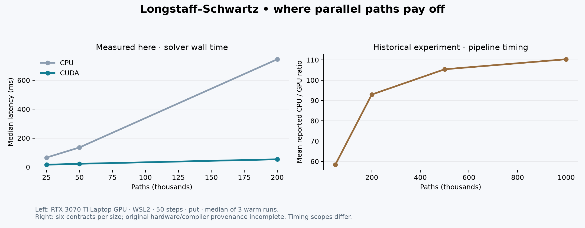
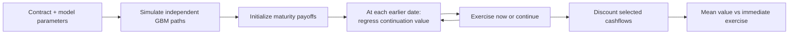
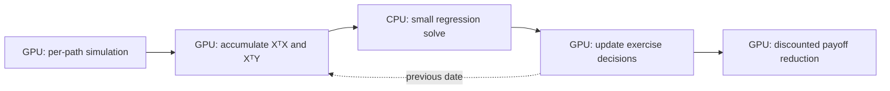

<div align="center">

<h1> LSM Solver</h1>

### American option pricing. Parallel paths. Measured performance.

**C++17 · CUDA · Monte Carlo · Longstaff–Schwartz**

[**Interactive results ↗**](https://damienwang.com/lsm) · [Quick download](#download-and-run) · [GPU quickstart](#run-on-your-gpu) · [Results](#performance-with-context) · [How it works](#how-the-solver-works) · [Research report](15418%20final%20report.pdf)

</div>

---

**Should an option be exercised now, or held for another step?** This solver estimates that decision across thousands of simulated price paths, then works backward to estimate an American option's value.

The project pairs a readable sequential implementation with a CUDA engine that parallelizes path simulation, regression accumulation, exercise decisions and payoff reduction. A shared command-line interface makes both implementations easy to run and compare.

On the locally tested **RTX 3070 Ti Laptop GPU**, the 200,000-path American-put workload took **53.56 ms on CUDA versus 745.13 ms on CPU: 13.9× faster**, measured inside the solver after warmup. [Raw measurements →](benchmarks/rtx3070-wsl.json)

## Download and run

No account, dataset or API key is needed. The model generates its own paths.

| Your machine | Download | Start here |
|---|---|---|
| Windows x64 | [**Windows demo ZIP**](downloads/lsm-windows-x64.zip) | Extract, then double-click **lsm_cpu.exe** |
| Ubuntu 24.04 / WSL2 x64 + compatible NVIDIA GPU | [**Linux CPU + CUDA ZIP**](downloads/lsm-linux-x64-cuda86.zip) | Extract, then run the commands below |
| Any machine with a browser | [**Offline results explorer ZIP**](downloads/lsm-results-explorer.zip) | Extract and open **index.html** |

On GitHub's ZIP file page, use **Download raw file**. The checked-in bundles become available through these links after this update is pushed. [Checksums and build provenance](downloads/README.md) accompany them.

### Windows: under a megabyte of executable

The Windows demo contains a self-contained **CPU** executable. Double-clicking runs a 50,000-path American put and keeps the result visible. No Python, CUDA Toolkit or compiler is needed.

For a custom run, open PowerShell in the extracted folder:

```powershell
.\lsm_cpu.exe --demo
.\lsm_cpu.exe --put --paths 200000 --steps 50
.\lsm_cpu.exe --call --S0 100 --K 90 --sigma 0.25 --json
```

The Windows binary is unsigned. Its source, build command and SHA-256 are provided for inspection.

### Linux / WSL2: ready-to-run CUDA

```bash
unzip lsm-linux-x64-cuda86.zip -d lsm-demo
cd lsm-demo
chmod +x lsm_cpu lsm_cuda
./lsm_cpu --demo
./lsm_cuda --put --paths 200000 --steps 50 --warmup 1 --repeat 3 --json
```

The GPU bundle was built on Ubuntu 24.04 with CUDA 12.6 for **compute capability 8.6**, including PTX. It was tested under WSL2 with an RTX 3070 Ti Laptop GPU and NVIDIA driver 560.94. It requires a compatible NVIDIA driver plus Ubuntu 24.04-era system libraries; the CUDA runtime is linked statically. For another GPU architecture or operating system, build from source.

## Build from source

The CPU build needs a C++17 compiler and CMake 3.24+. On Windows, use a Visual Studio Developer PowerShell with the C++ tools installed.

```bash
git clone --depth 1 https://github.com/Yunfan-Wang/CMU15418-High-performance-Longstaff-Schwartz-Solver.git
cd CMU15418-High-performance-Longstaff-Schwartz-Solver
cmake -S . -B build -DCMAKE_BUILD_TYPE=Release
cmake --build build --config Release --parallel
ctest --test-dir build -C Release --output-on-failure
```

Linux/macOS: run **./build/lsm_cpu --demo**. Visual Studio builds: run **.\build\Release\lsm_cpu.exe --demo**.

### Run on your GPU

Install a compatible NVIDIA driver, CUDA Toolkit and host C++ compiler. Then:

```bash
cmake -S . -B build-gpu -DCMAKE_BUILD_TYPE=Release -DLSM_ENABLE_CUDA=ON -DCMAKE_CUDA_ARCHITECTURES=native
cmake --build build-gpu --config Release --parallel
./build-gpu/lsm_cuda --put --paths 200000 --steps 50 --warmup 1 --repeat 3 --json
```

Visual Studio places the binary in **build-gpu/Release/lsm_cuda.exe**. The native architecture option targets the GPU on the build machine; choose an explicit CUDA architecture when cross-building. Native Windows CUDA compilation is supported by the build definition but has not been tested locally; Linux/WSL2 CUDA has.

The root CMake project replaces the need to edit the historical Makefile's hard-coded compiler and CUDA paths.

## A result you can inspect

Example CPU output for the default contract:

```text
LSM Solver | cpu | American put
50000 paths x 50 exercise dates | degree 2 | seed 42
Price estimate: 6.04052551636
Solver wall time: [measured on your machine] ms
```

The corresponding CUDA estimate on the tested machine was **6.07304**. CPU uses MT19937-64; CUDA uses Philox. The same seed does not create identical paths across those generators.

Open the [**interactive results explorer on damienwang.com**](https://damienwang.com/lsm) to switch path counts and contracts, compare prices and latency, and copy a matching run command. An [offline download](downloads/lsm-results-explorer.zip) also works without a server or internet connection. GitHub does not execute JavaScript inside a README, so the live explorer opens as a separate page.

## Performance with context

<p align="center"><a href="docs/assets/performance.png"></a></p>

### New measurement: full solver wall time

WSL2 / Ubuntu 24.04, GCC 13.3, CUDA 12.6, RTX 3070 Ti Laptop GPU. Put, spot/strike 100, rate 0.05, volatility 0.2, maturity 1, 50 steps, degree 2, seed 42. One warmup followed by three measured calls; table reports medians.

| Paths | CPU | CUDA | Ratio |
|---:|---:|---:|---:|
| 25,000 | 65.59 ms | 16.26 ms | 4.0× |
| 50,000 | 135.48 ms | 22.66 ms | 6.0× |
| 200,000 | 745.13 ms | 53.56 ms | 13.9× |

These timings include solver allocation and cleanup but exclude process startup and device discovery. First-use CUDA initialization can dominate a small one-shot job. The raw JSON also records whole-process time including warmup and all repetitions. This is one laptop measurement, not a hardware-independent promise.

### Historical research results

The original [GPU CSV](gpu/results_gpu.csv), [CPU CSV](gpu/results_baseline.csv) and [summary](gpu/summary.csv) cover six contracts at each path count. Mean recorded CPU/GPU ratios range from **58.4× at 50,000 paths to 110.3× at 1,000,000 paths**.

The historical GPU event timer excludes allocation/setup, and the records do not contain complete hardware/compiler provenance. Those numbers are preserved as research artifacts and are not directly comparable to the new solver-wall-time table. Price differences are sampling/implementation comparisons, not errors against an exact American-option oracle.

### Reproduce your own measurement

```bash
python scripts/verify.py --cpu build-gpu/lsm_cpu --cuda build-gpu/lsm_cuda
python scripts/benchmark.py --cpu build-gpu/lsm_cpu --cuda build-gpu/lsm_cuda --paths 25000 50000 200000 --output benchmarks/local.json
```

The scripts use Python's standard library. Plot regeneration additionally needs Matplotlib. [Benchmark methodology →](docs/BENCHMARKS.md)

## How the solver works



At each date, the solver fits discounted future cashflows against a polynomial basis of spot prices for in-the-money paths. If immediate payoff exceeds estimated continuation, the path's exercise decision is updated.

**Paths run in parallel; exercise dates remain sequential.** The CUDA implementation keeps paths and cashflows on the device, reduces regression statistics across blocks, transfers the small system to the CPU, and sends coefficients back for parallel exercise decisions.



For N paths, M dates and polynomial degree d, path storage is roughly **8·N·(M+1) bytes** before working arrays. At 200,000 paths and 50 dates, that is about **81.6 MB**. The quick-start CLI caps the path matrix at 2 GiB and accepts degrees 0–7; degree 2 is the recommended starting point.

## Where it fits

| Use case | Fit |
|---|---|
| Learning Monte Carlo optimal stopping | Readable CPU reference and matching CUDA pipeline |
| Studying GPU reductions and parallel numerical workloads | Explicit kernels, small host solve, timing breakdown |
| Comparing path-count/runtime tradeoffs | Shared CLI, JSON output and reproducible benchmark scripts |
| Large single-underlying simulation experiments | CUDA can amortize initialization across repeated workloads |
| Tiny one-off calculations | CPU avoids CUDA startup overhead |
| Production valuation, calibrated market models, exotic portfolios | Beyond the current implementation |

The supported model is a **single underlying, constant-volatility geometric Brownian motion, constant rate, no dividends**, with vanilla call/put payoffs and a finite exercise grid. There is no market-data calibration, multi-asset payoff API, Greeks engine or independently certified error bound.

## Which implementation should I use?

| Path | Role | Status |
|---|---|---|
| app/ + default/src/ | Portable CPU quickstart | Built and tested on Windows and Linux |
| app/ + gpu/ | Global-regression CUDA quickstart | Built and tested on the local NVIDIA GPU |
| advanced/ | Experimental iterative MPI research | Compiles/runs; accuracy needs further validation |
| gpuTest/ | Experimental block-local regression | Preserved research variant; not the default |
| MPI/ | Historical conventional MPI artifacts | Source directory is absent in this checkout; existing build artifacts are not a reproducible build |

The optional experimental target is enabled with **-DLSM_ENABLE_MPI=ON** and produces **lsm_mpi**. Its current pricing output did not meet the quickstart's reference range in a two-rank smoke run, so it is deliberately excluded from the recommended pricing path.

## Correctness and project checks

- Numerical checks cover the linear solve, repeatability, broad option-price ranges and the immediate-exercise lower bound.
- Executable checks reject malformed/oversized inputs and exercise deterministic volatility, singular-regression and CPU/CUDA comparison cases.
- CI builds/tests CPU on Linux and Windows and compile-checks CUDA.
- CUDA runtime checks require real hardware; hosted CI's CUDA job does not claim GPU execution.

This update also fixes the missing time-zero exercise choice and skips singular CUDA regressions instead of using partially solved coefficients. The original report/results predate these fixes.

## Next steps

- [ ] Out-of-sample exercise-policy evaluation and multi-seed confidence intervals.
- [ ] Better-conditioned basis functions and QR/SVD regression alternatives.
- [ ] Persistent device buffers, reduced synchronization and coalesced path layout.
- [ ] Correctness work on the iterative MPI variant before publishing comparable speedups.
- [ ] A dedicated GPU CI runner and versioned release binaries.
- [ ] Dividends, richer dynamics and payoff extensions with independent references.

## Explore the repository

```text
app/            Portable CPU/CUDA command-line interface
default/        Sequential Longstaff–Schwartz reference
gpu/            Global-regression CUDA implementation and original results
advanced/       Experimental iterative MPI implementation
gpuTest/        Experimental block-local CUDA variant
scripts/        Verification, benchmark, plot and demo generation
tests/          Numerical regression checks
downloads/      Small runnable bundles, checksums and provenance
demo/           Standalone interactive results explorer
docs/           Architecture, benchmarking and validation notes
```

[Final report](15418%20final%20report.pdf) · [Numerical scope](docs/NUMERICS.md) · [Validation record](docs/VALIDATION.md) · [Contributing](CONTRIBUTING.md)
